# Architecture Technique — Assistant Pastoral

## Stack : Electron + React + TypeScript

---

## Table des matières

1. [Vue d'ensemble](#1-vue-densemble)
2. [Structure du projet](#2-structure-du-projet)
3. [Architecture applicative](#3-architecture-applicative)
4. [Couche Main Process (Backend)](#4-couche-main-process-backend)
5. [Couche Renderer Process (Frontend)](#5-couche-renderer-process-frontend)
6. [Base de données](#6-base-de-données)
7. [Extraction de texte](#7-extraction-de-texte)
8. [Intégration IA (Claude)](#8-intégration-ia-claude)
9. [Communication IPC](#9-communication-ipc)
10. [Gestion d'état](#10-gestion-détat)
11. [Sécurité](#11-sécurité)
12. [Build et distribution](#12-build-et-distribution)
13. [Tests](#13-tests)
14. [Diagrammes techniques](#14-diagrammes-techniques)

---

## 1. Vue d'ensemble

### 1.1 Stack technologique

```
┌─────────────────────────────────────────────────────────────┐
│                    ASSISTANT PASTORAL                        │
├─────────────────────────────────────────────────────────────┤
│  Frontend (Renderer Process)                                │
│  ├── React 18                                               │
│  ├── TypeScript 5.3+                                        │
│  ├── Tailwind CSS 3.4                                       │
│  ├── Zustand (état global)                                  │
│  ├── React Query (cache & async)                            │
│  └── Lucide React (icônes)                                  │
├─────────────────────────────────────────────────────────────┤
│  Backend (Main Process - Node.js)                           │
│  ├── Electron 28+                                           │
│  ├── better-sqlite3 (base de données)                       │
│  ├── pdf-parse (extraction PDF)                             │
│  ├── mammoth (extraction DOCX)                              │
│  ├── @anthropic-ai/sdk (API Claude)                         │
│  └── chokidar (surveillance fichiers)                       │
├─────────────────────────────────────────────────────────────┤
│  Build & Tooling                                            │
│  ├── Vite (bundler frontend)                                │
│  ├── electron-builder (packaging)                           │
│  ├── ESLint + Prettier                                      │
│  └── Vitest (tests)                                         │
└─────────────────────────────────────────────────────────────┘
```

### 1.2 Principes architecturaux

| Principe | Application |
|----------|-------------|
| **Séparation des responsabilités** | Main Process = données, Renderer = UI |
| **Communication asynchrone** | Tout via IPC, jamais de blocage UI |
| **Données locales** | SQLite embarqué, pas de serveur distant |
| **Sécurité par défaut** | Context isolation, pas de nodeIntegration |
| **Offline-first** | Fonctionne sans internet (sauf IA) |

---

## 2. Structure du projet

```
assistant-pastoral/
├── 📁 src/
│   ├── 📁 main/                    # Electron Main Process
│   │   ├── index.ts                # Point d'entrée principal
│   │   ├── window.ts               # Gestion fenêtre
│   │   ├── ipc/                    # Handlers IPC
│   │   │   ├── index.ts            # Registration des handlers
│   │   │   ├── documents.ipc.ts    # CRUD documents
│   │   │   ├── search.ipc.ts       # Recherche
│   │   │   ├── ai.ipc.ts           # Requêtes Claude
│   │   │   └── settings.ipc.ts     # Paramètres
│   │   ├── services/               # Logique métier
│   │   │   ├── database.service.ts # SQLite
│   │   │   ├── indexer.service.ts  # Indexation
│   │   │   ├── search.service.ts   # Recherche FTS5
│   │   │   ├── claude.service.ts   # API Anthropic
│   │   │   └── watcher.service.ts  # Surveillance fichiers
│   │   ├── extractors/             # Extraction de texte
│   │   │   ├── index.ts            # Factory
│   │   │   ├── pdf.extractor.ts
│   │   │   ├── docx.extractor.ts
│   │   │   ├── odt.extractor.ts
│   │   │   └── markdown.extractor.ts
│   │   ├── utils/                  # Utilitaires
│   │   │   ├── paths.ts            # Chemins app
│   │   │   ├── hash.ts             # MD5 fichiers
│   │   │   └── logger.ts           # Logging
│   │   └── types/                  # Types partagés
│   │       └── index.ts
│   │
│   ├── 📁 renderer/                # React Frontend
│   │   ├── index.html              # HTML template
│   │   ├── main.tsx                # Point d'entrée React
│   │   ├── App.tsx                 # Composant racine
│   │   ├── 📁 components/          # Composants UI
│   │   │   ├── layout/
│   │   │   │   ├── Header.tsx
│   │   │   │   ├── Sidebar.tsx
│   │   │   │   └── MainContent.tsx
│   │   │   ├── chat/
│   │   │   │   ├── ChatPanel.tsx
│   │   │   │   ├── MessageList.tsx
│   │   │   │   ├── MessageBubble.tsx
│   │   │   │   └── ChatInput.tsx
│   │   │   ├── documents/
│   │   │   │   ├── DocumentList.tsx
│   │   │   │   ├── DocumentItem.tsx
│   │   │   │   └── DocumentViewer.tsx
│   │   │   ├── settings/
│   │   │   │   └── SettingsPanel.tsx
│   │   │   └── common/
│   │   │       ├── Button.tsx
│   │   │       ├── Input.tsx
│   │   │       ├── Modal.tsx
│   │   │       └── LoadingSpinner.tsx
│   │   ├── 📁 hooks/               # Custom hooks
│   │   │   ├── useDocuments.ts
│   │   │   ├── useSearch.ts
│   │   │   ├── useChat.ts
│   │   │   └── useSettings.ts
│   │   ├── 📁 stores/              # Zustand stores
│   │   │   ├── documents.store.ts
│   │   │   ├── chat.store.ts
│   │   │   ├── ui.store.ts
│   │   │   └── settings.store.ts
│   │   ├── 📁 lib/                 # Utilitaires frontend
│   │   │   ├── ipc.ts              # Client IPC typé
│   │   │   ├── format.ts           # Formatage dates, etc.
│   │   │   └── cn.ts               # Classnames helper
│   │   ├── 📁 styles/
│   │   │   └── globals.css         # Tailwind + custom
│   │   └── 📁 types/
│   │       └── index.ts
│   │
│   ├── 📁 shared/                  # Code partagé main/renderer
│   │   ├── types.ts                # Types communs
│   │   ├── constants.ts            # Constantes
│   │   └── ipc-channels.ts         # Noms des canaux IPC
│   │
│   └── 📁 preload/                 # Script preload
│       └── index.ts                # Expose API sécurisée
│
├── 📁 resources/                   # Assets statiques
│   ├── icon.png                    # Icône app (1024x1024)
│   ├── icon.ico                    # Windows
│   └── icon.icns                   # macOS
│
├── 📁 scripts/                     # Scripts de build
│   └── notarize.js                 # Notarisation macOS
│
├── 📁 tests/                       # Tests
│   ├── main/                       # Tests backend
│   └── renderer/                   # Tests frontend
│
├── .env.example                    # Variables d'environnement
├── .eslintrc.cjs                   # Config ESLint
├── .prettierrc                     # Config Prettier
├── electron-builder.yml            # Config packaging
├── package.json
├── tsconfig.json                   # Config TS (base)
├── tsconfig.main.json              # Config TS main
├── tsconfig.renderer.json          # Config TS renderer
├── vite.config.ts                  # Config Vite
└── README.md
```

---

## 3. Architecture applicative

### 3.1 Diagramme de flux global

```mermaid
flowchart TB
    subgraph Renderer["Renderer Process (React)"]
        UI[Interface Utilisateur]
        Store[Zustand Stores]
        Hooks[Custom Hooks]
        IPC_Client[IPC Client]
    end
    
    subgraph Preload["Preload Script"]
        Bridge[Context Bridge]
    end
    
    subgraph Main["Main Process (Node.js)"]
        IPC_Main[IPC Handlers]
        Services[Services]
        DB[(SQLite)]
        Extractors[Extractors]
    end
    
    subgraph External["Externe"]
        FS[Système de fichiers]
        Claude[API Claude]
    end
    
    UI --> Store
    Store --> Hooks
    Hooks --> IPC_Client
    IPC_Client --> Bridge
    Bridge --> IPC_Main
    IPC_Main --> Services
    Services --> DB
    Services --> Extractors
    Extractors --> FS
    Services --> Claude

    style Renderer fill:#e3f2fd
    style Main fill:#fff3e0
    style External fill:#f3e5f5
```



### 3.2 Flux de données


---

## 4. Couche Main Process (Backend)

### 4.1 Point d'entrée (src/main/index.ts)

```typescript
import { app, BrowserWindow } from 'electron';
import { createWindow } from './window';
import { initDatabase } from './services/database.service';
import { registerIpcHandlers } from './ipc';
import { initWatcher } from './services/watcher.service';

// Handle creating/removing shortcuts on Windows
if (require('electron-squirrel-startup')) {
  app.quit();
}

let mainWindow: BrowserWindow | null = null;

async function bootstrap() {
  // Initialiser la base de données
  await initDatabase();
  
  // Enregistrer les handlers IPC
  registerIpcHandlers();
  
  // Créer la fenêtre principale
  mainWindow = createWindow();
  
  // Initialiser le watcher de fichiers (si dossier configuré)
  await initWatcher();
}

app.whenReady().then(bootstrap);

app.on('window-all-closed', () => {
  if (process.platform !== 'darwin') {
    app.quit();
  }
});

app.on('activate', () => {
  if (BrowserWindow.getAllWindows().length === 0) {
    mainWindow = createWindow();
  }
});
```

### 4.2 Création de fenêtre (src/main/window.ts)

```typescript
import { BrowserWindow, shell } from 'electron';
import path from 'path';

export function createWindow(): BrowserWindow {
  const mainWindow = new BrowserWindow({
    width: 1200,
    height: 800,
    minWidth: 900,
    minHeight: 600,
    title: 'Assistant Pastoral',
    icon: path.join(__dirname, '../../resources/icon.png'),
    webPreferences: {
      preload: path.join(__dirname, '../preload/index.js'),
      contextIsolation: true,      // Sécurité : isolation du contexte
      nodeIntegration: false,       // Sécurité : pas de Node dans renderer
      sandbox: true,                // Sécurité : sandbox activé
    },
    // Style de fenêtre
    backgroundColor: '#FAF7F2',
    titleBarStyle: process.platform === 'darwin' ? 'hiddenInset' : 'default',
    trafficLightPosition: { x: 15, y: 15 },
  });

  // Charger l'app
  if (process.env.NODE_ENV === 'development') {
    mainWindow.loadURL('http://localhost:5173');
    mainWindow.webContents.openDevTools();
  } else {
    mainWindow.loadFile(path.join(__dirname, '../renderer/index.html'));
  }

  // Ouvrir les liens externes dans le navigateur
  mainWindow.webContents.setWindowOpenHandler(({ url }) => {
    shell.openExternal(url);
    return { action: 'deny' };
  });

  return mainWindow;
}
```

### 4.3 Service Base de données (src/main/services/database.service.ts)

```typescript
import Database from 'better-sqlite3';
import path from 'path';
import { app } from 'electron';
import { Document, Conversation, Message, Settings } from '../../shared/types';

let db: Database.Database;

export function getDb(): Database.Database {
  if (!db) {
    throw new Error('Database not initialized');
  }
  return db;
}

export async function initDatabase(): Promise<void> {
  const dbPath = path.join(app.getPath('userData'), 'sermons.db');
  
  db = new Database(dbPath);
  db.pragma('journal_mode = WAL');  // Meilleure performance
  db.pragma('foreign_keys = ON');
  
  // Créer les tables
  db.exec(`
    -- Table des documents
    CREATE TABLE IF NOT EXISTS documents (
      id INTEGER PRIMARY KEY AUTOINCREMENT,
      path TEXT UNIQUE NOT NULL,
      title TEXT NOT NULL,
      content TEXT NOT NULL,
      date TEXT,
      bible_ref TEXT,
      word_count INTEGER DEFAULT 0,
      hash TEXT NOT NULL,
      indexed_at DATETIME DEFAULT CURRENT_TIMESTAMP,
      updated_at DATETIME DEFAULT CURRENT_TIMESTAMP
    );
    
    -- Index FTS5 pour recherche full-text
    CREATE VIRTUAL TABLE IF NOT EXISTS documents_fts USING fts5(
      title,
      content,
      bible_ref,
      content='documents',
      content_rowid='id',
      tokenize='unicode61 remove_diacritics 2'
    );
    
    -- Triggers pour synchroniser FTS5
    CREATE TRIGGER IF NOT EXISTS documents_ai AFTER INSERT ON documents BEGIN
      INSERT INTO documents_fts(rowid, title, content, bible_ref)
      VALUES (new.id, new.title, new.content, new.bible_ref);
    END;
    
    CREATE TRIGGER IF NOT EXISTS documents_ad AFTER DELETE ON documents BEGIN
      INSERT INTO documents_fts(documents_fts, rowid, title, content, bible_ref)
      VALUES ('delete', old.id, old.title, old.content, old.bible_ref);
    END;
    
    CREATE TRIGGER IF NOT EXISTS documents_au AFTER UPDATE ON documents BEGIN
      INSERT INTO documents_fts(documents_fts, rowid, title, content, bible_ref)
      VALUES ('delete', old.id, old.title, old.content, old.bible_ref);
      INSERT INTO documents_fts(rowid, title, content, bible_ref)
      VALUES (new.id, new.title, new.content, new.bible_ref);
    END;
    
    -- Table des conversations
    CREATE TABLE IF NOT EXISTS conversations (
      id INTEGER PRIMARY KEY AUTOINCREMENT,
      title TEXT,
      created_at DATETIME DEFAULT CURRENT_TIMESTAMP,
      updated_at DATETIME DEFAULT CURRENT_TIMESTAMP
    );
    
    -- Table des messages
    CREATE TABLE IF NOT EXISTS messages (
      id INTEGER PRIMARY KEY AUTOINCREMENT,
      conversation_id INTEGER NOT NULL,
      role TEXT NOT NULL CHECK (role IN ('user', 'assistant')),
      content TEXT NOT NULL,
      tokens_used INTEGER DEFAULT 0,
      created_at DATETIME DEFAULT CURRENT_TIMESTAMP,
      FOREIGN KEY (conversation_id) REFERENCES conversations(id) ON DELETE CASCADE
    );
    
    -- Table des paramètres
    CREATE TABLE IF NOT EXISTS settings (
      key TEXT PRIMARY KEY,
      value TEXT NOT NULL
    );
    
    -- Table des crédits
    CREATE TABLE IF NOT EXISTS credits (
      id INTEGER PRIMARY KEY CHECK (id = 1),
      balance INTEGER DEFAULT 100,
      updated_at DATETIME DEFAULT CURRENT_TIMESTAMP
    );
    
    -- Initialiser les crédits
    INSERT OR IGNORE INTO credits (id, balance) VALUES (1, 100);
  `);
  
  console.log('Database initialized at:', dbPath);
}

// ============ DOCUMENTS ============

export function getAllDocuments(): Document[] {
  return getDb()
    .prepare('SELECT * FROM documents ORDER BY date DESC, title ASC')
    .all() as Document[];
}

export function getDocumentById(id: number): Document | undefined {
  return getDb()
    .prepare('SELECT * FROM documents WHERE id = ?')
    .get(id) as Document | undefined;
}

export function insertDocument(doc: Omit<Document, 'id' | 'indexed_at' | 'updated_at'>): number {
  const result = getDb()
    .prepare(`
      INSERT INTO documents (path, title, content, date, bible_ref, word_count, hash)
      VALUES (@path, @title, @content, @date, @bible_ref, @word_count, @hash)
    `)
    .run(doc);
  return result.lastInsertRowid as number;
}

export function updateDocument(id: number, doc: Partial<Document>): void {
  const fields = Object.keys(doc)
    .filter(k => k !== 'id')
    .map(k => `${k} = @${k}`)
    .join(', ');
  
  getDb()
    .prepare(`UPDATE documents SET ${fields}, updated_at = CURRENT_TIMESTAMP WHERE id = @id`)
    .run({ ...doc, id });
}

export function deleteDocument(id: number): void {
  getDb().prepare('DELETE FROM documents WHERE id = ?').run(id);
}

export function getDocumentByPath(path: string): Document | undefined {
  return getDb()
    .prepare('SELECT * FROM documents WHERE path = ?')
    .get(path) as Document | undefined;
}

// ============ SEARCH ============

export function searchDocuments(query: string, limit = 20): Document[] {
  // Escape special FTS5 characters
  const escapedQuery = query.replace(/['"]/g, '');
  
  return getDb()
    .prepare(`
      SELECT d.*, 
             bm25(documents_fts) AS rank,
             snippet(documents_fts, 1, '<mark>', '</mark>', '...', 32) AS snippet
      FROM documents_fts
      JOIN documents d ON d.id = documents_fts.rowid
      WHERE documents_fts MATCH ?
      ORDER BY rank
      LIMIT ?
    `)
    .all(escapedQuery, limit) as Document[];
}

// ============ CONVERSATIONS ============

export function createConversation(title?: string): number {
  const result = getDb()
    .prepare('INSERT INTO conversations (title) VALUES (?)')
    .run(title || null);
  return result.lastInsertRowid as number;
}

export function getConversation(id: number): Conversation | undefined {
  return getDb()
    .prepare('SELECT * FROM conversations WHERE id = ?')
    .get(id) as Conversation | undefined;
}

export function getConversationMessages(conversationId: number): Message[] {
  return getDb()
    .prepare('SELECT * FROM messages WHERE conversation_id = ? ORDER BY created_at ASC')
    .all(conversationId) as Message[];
}

export function addMessage(conversationId: number, role: 'user' | 'assistant', content: string, tokens = 0): number {
  const result = getDb()
    .prepare(`
      INSERT INTO messages (conversation_id, role, content, tokens_used)
      VALUES (?, ?, ?, ?)
    `)
    .run(conversationId, role, content, tokens);
  
  // Mettre à jour la conversation
  getDb()
    .prepare('UPDATE conversations SET updated_at = CURRENT_TIMESTAMP WHERE id = ?')
    .run(conversationId);
    
  return result.lastInsertRowid as number;
}

// ============ CREDITS ============

export function getCredits(): number {
  const result = getDb()
    .prepare('SELECT balance FROM credits WHERE id = 1')
    .get() as { balance: number };
  return result?.balance ?? 0;
}

export function updateCredits(delta: number): number {
  getDb()
    .prepare('UPDATE credits SET balance = balance + ?, updated_at = CURRENT_TIMESTAMP WHERE id = 1')
    .run(delta);
  return getCredits();
}

// ============ SETTINGS ============

export function getSetting(key: string): string | undefined {
  const result = getDb()
    .prepare('SELECT value FROM settings WHERE key = ?')
    .get(key) as { value: string } | undefined;
  return result?.value;
}

export function setSetting(key: string, value: string): void {
  getDb()
    .prepare('INSERT OR REPLACE INTO settings (key, value) VALUES (?, ?)')
    .run(key, value);
}

export function getAllSettings(): Record<string, string> {
  const rows = getDb()
    .prepare('SELECT key, value FROM settings')
    .all() as { key: string; value: string }[];
  return Object.fromEntries(rows.map(r => [r.key, r.value]));
}
```

### 4.4 Service d'indexation (src/main/services/indexer.service.ts)

```typescript
import fs from 'fs/promises';
import path from 'path';
import crypto from 'crypto';
import { 
  insertDocument, 
  getDocumentByPath, 
  updateDocument, 
  deleteDocument,
  getAllDocuments 
} from './database.service';
import { extractText } from '../extractors';
import { Document } from '../../shared/types';

const SUPPORTED_EXTENSIONS = ['.pdf', '.docx', '.doc', '.md', '.txt', '.odt'];

interface IndexingProgress {
  total: number;
  current: number;
  currentFile: string;
}

type ProgressCallback = (progress: IndexingProgress) => void;

export async function indexFolder(
  folderPath: string, 
  onProgress?: ProgressCallback
): Promise<{ added: number; updated: number; errors: string[] }> {
  const result = { added: 0, updated: 0, errors: [] as string[] };
  
  // Récupérer tous les fichiers supportés
  const files = await getFilesRecursive(folderPath);
  const supportedFiles = files.filter(f => 
    SUPPORTED_EXTENSIONS.includes(path.extname(f).toLowerCase())
  );
  
  // Indexer chaque fichier
  for (let i = 0; i < supportedFiles.length; i++) {
    const filePath = supportedFiles[i];
    
    onProgress?.({
      total: supportedFiles.length,
      current: i + 1,
      currentFile: path.basename(filePath)
    });
    
    try {
      const wasUpdated = await indexFile(filePath);
      if (wasUpdated === 'added') result.added++;
      else if (wasUpdated === 'updated') result.updated++;
    } catch (error) {
      result.errors.push(`${path.basename(filePath)}: ${(error as Error).message}`);
    }
  }
  
  return result;
}

async function indexFile(filePath: string): Promise<'added' | 'updated' | 'unchanged'> {
  // Calculer le hash du fichier
  const fileBuffer = await fs.readFile(filePath);
  const hash = crypto.createHash('md5').update(fileBuffer).digest('hex');
  
  // Vérifier si le document existe déjà
  const existing = getDocumentByPath(filePath);
  
  if (existing) {
    // Si le hash est identique, pas de mise à jour nécessaire
    if (existing.hash === hash) {
      return 'unchanged';
    }
  }
  
  // Extraire le texte
  const extracted = await extractText(filePath);
  
  // Préparer le document
  const doc = {
    path: filePath,
    title: extracted.title || path.basename(filePath, path.extname(filePath)),
    content: extracted.content,
    date: extracted.date || null,
    bible_ref: extracted.bibleRef || null,
    word_count: extracted.content.split(/\s+/).length,
    hash
  };
  
  if (existing) {
    updateDocument(existing.id, doc);
    return 'updated';
  } else {
    insertDocument(doc);
    return 'added';
  }
}

async function getFilesRecursive(dir: string): Promise<string[]> {
  const entries = await fs.readdir(dir, { withFileTypes: true });
  const files: string[] = [];
  
  for (const entry of entries) {
    const fullPath = path.join(dir, entry.name);
    
    // Ignorer les dossiers cachés
    if (entry.name.startsWith('.')) continue;
    
    if (entry.isDirectory()) {
      files.push(...await getFilesRecursive(fullPath));
    } else {
      files.push(fullPath);
    }
  }
  
  return files;
}

export async function removeDeletedDocuments(folderPath: string): Promise<number> {
  const documents = getAllDocuments();
  let removed = 0;
  
  for (const doc of documents) {
    // Vérifier que le document est dans le dossier surveillé
    if (!doc.path.startsWith(folderPath)) continue;
    
    try {
      await fs.access(doc.path);
    } catch {
      // Le fichier n'existe plus
      deleteDocument(doc.id);
      removed++;
    }
  }
  
  return removed;
}
```

### 4.5 Service Claude (src/main/services/claude.service.ts)

```typescript
import Anthropic from '@anthropic-ai/sdk';
import { getSetting, getCredits, updateCredits } from './database.service';
import { searchDocuments } from './database.service';

let client: Anthropic | null = null;

function getClient(): Anthropic {
  if (!client) {
    const apiKey = getSetting('anthropic_api_key');
    if (!apiKey) {
      throw new Error('Clé API Anthropic non configurée');
    }
    client = new Anthropic({ apiKey });
  }
  return client;
}

export function resetClient(): void {
  client = null;
}

interface ChatRequest {
  message: string;
  conversationHistory?: { role: 'user' | 'assistant'; content: string }[];
}

interface ChatResponse {
  response: string;
  tokensUsed: number;
  sources: { id: number; title: string; snippet: string }[];
}

export async function chat(request: ChatRequest): Promise<ChatResponse> {
  // Vérifier les crédits
  const credits = getCredits();
  if (credits <= 0) {
    throw new Error('Crédits insuffisants');
  }
  
  // Rechercher les documents pertinents
  const relevantDocs = searchDocuments(request.message, 5);
  
  // Construire le contexte
  const context = relevantDocs.map(doc => `
---
Document: ${doc.title}
${doc.date ? `Date: ${doc.date}` : ''}
${doc.bible_ref ? `Référence: ${doc.bible_ref}` : ''}

${doc.content.substring(0, 2000)}${doc.content.length > 2000 ? '...' : ''}
---
`).join('\n');

  // Construire le prompt système
  const systemPrompt = `Tu es un assistant pour pasteurs. Tu aides à rechercher et analyser des sermons.

Tu as accès aux sermons suivants de l'utilisateur :

${context}

Instructions :
- Réponds en français
- Base tes réponses sur les documents fournis quand c'est pertinent
- Cite les sources (titre du sermon) quand tu t'en inspires
- Si tu ne trouves pas l'information dans les documents, dis-le clairement
- Sois concis mais complet`;

  // Construire les messages
  const messages: Anthropic.MessageParam[] = [
    ...(request.conversationHistory || []).map(msg => ({
      role: msg.role as 'user' | 'assistant',
      content: msg.content
    })),
    { role: 'user', content: request.message }
  ];

  // Appeler l'API
  const response = await getClient().messages.create({
    model: 'claude-sonnet-4-20250514',
    max_tokens: 2048,
    system: systemPrompt,
    messages
  });

  // Calculer les tokens utilisés
  const tokensUsed = response.usage.input_tokens + response.usage.output_tokens;
  
  // Décrémenter les crédits (1 crédit = ~1000 tokens)
  const creditsUsed = Math.ceil(tokensUsed / 1000);
  updateCredits(-creditsUsed);

  // Extraire la réponse textuelle
  const textContent = response.content.find(c => c.type === 'text');
  const responseText = textContent?.type === 'text' ? textContent.text : '';

  return {
    response: responseText,
    tokensUsed,
    sources: relevantDocs.map(d => ({
      id: d.id,
      title: d.title,
      snippet: (d as any).snippet || d.content.substring(0, 200)
    }))
  };
}

export async function summarizeDocument(documentId: number, content: string, title: string): Promise<string> {
  // Vérifier les crédits
  const credits = getCredits();
  if (credits <= 0) {
    throw new Error('Crédits insuffisants');
  }

  const response = await getClient().messages.create({
    model: 'claude-sonnet-4-20250514',
    max_tokens: 1024,
    system: 'Tu es un assistant pour pasteurs. Résume les sermons de manière concise et structurée.',
    messages: [{
      role: 'user',
      content: `Résume ce sermon intitulé "${title}" en 3-5 points clés :\n\n${content.substring(0, 8000)}`
    }]
  });

  const tokensUsed = response.usage.input_tokens + response.usage.output_tokens;
  const creditsUsed = Math.ceil(tokensUsed / 1000);
  updateCredits(-creditsUsed);

  const textContent = response.content.find(c => c.type === 'text');
  return textContent?.type === 'text' ? textContent.text : '';
}
```

---

## 5. Couche Renderer Process (Frontend)

### 5.1 Preload Script (src/preload/index.ts)

```typescript
import { contextBridge, ipcRenderer } from 'electron';
import { IPC_CHANNELS } from '../shared/ipc-channels';

// Exposer une API sécurisée au renderer
contextBridge.exposeInMainWorld('electronAPI', {
  // Documents
  documents: {
    getAll: () => ipcRenderer.invoke(IPC_CHANNELS.DOCUMENTS_GET_ALL),
    getById: (id: number) => ipcRenderer.invoke(IPC_CHANNELS.DOCUMENTS_GET_BY_ID, id),
    delete: (id: number) => ipcRenderer.invoke(IPC_CHANNELS.DOCUMENTS_DELETE, id),
    openExternal: (id: number) => ipcRenderer.invoke(IPC_CHANNELS.DOCUMENTS_OPEN_EXTERNAL, id),
  },
  
  // Indexation
  indexer: {
    selectFolder: () => ipcRenderer.invoke(IPC_CHANNELS.INDEXER_SELECT_FOLDER),
    indexFolder: (path: string) => ipcRenderer.invoke(IPC_CHANNELS.INDEXER_INDEX_FOLDER, path),
    onProgress: (callback: (progress: any) => void) => {
      ipcRenderer.on(IPC_CHANNELS.INDEXER_PROGRESS, (_, progress) => callback(progress));
      return () => ipcRenderer.removeAllListeners(IPC_CHANNELS.INDEXER_PROGRESS);
    },
  },
  
  // Recherche
  search: {
    query: (query: string) => ipcRenderer.invoke(IPC_CHANNELS.SEARCH_QUERY, query),
  },
  
  // Chat IA
  chat: {
    send: (message: string, history?: any[]) => 
      ipcRenderer.invoke(IPC_CHANNELS.CHAT_SEND, message, history),
    summarize: (documentId: number) => 
      ipcRenderer.invoke(IPC_CHANNELS.CHAT_SUMMARIZE, documentId),
  },
  
  // Crédits
  credits: {
    get: () => ipcRenderer.invoke(IPC_CHANNELS.CREDITS_GET),
    purchase: (amount: number) => ipcRenderer.invoke(IPC_CHANNELS.CREDITS_PURCHASE, amount),
  },
  
  // Paramètres
  settings: {
    get: (key: string) => ipcRenderer.invoke(IPC_CHANNELS.SETTINGS_GET, key),
    set: (key: string, value: string) => ipcRenderer.invoke(IPC_CHANNELS.SETTINGS_SET, key, value),
    getAll: () => ipcRenderer.invoke(IPC_CHANNELS.SETTINGS_GET_ALL),
  },
});

// Types pour TypeScript
export type ElectronAPI = typeof electronAPI;
declare global {
  interface Window {
    electronAPI: ElectronAPI;
  }
}
```

### 5.2 Canaux IPC (src/shared/ipc-channels.ts)

```typescript
export const IPC_CHANNELS = {
  // Documents
  DOCUMENTS_GET_ALL: 'documents:getAll',
  DOCUMENTS_GET_BY_ID: 'documents:getById',
  DOCUMENTS_DELETE: 'documents:delete',
  DOCUMENTS_OPEN_EXTERNAL: 'documents:openExternal',
  
  // Indexation
  INDEXER_SELECT_FOLDER: 'indexer:selectFolder',
  INDEXER_INDEX_FOLDER: 'indexer:indexFolder',
  INDEXER_PROGRESS: 'indexer:progress',
  
  // Recherche
  SEARCH_QUERY: 'search:query',
  
  // Chat
  CHAT_SEND: 'chat:send',
  CHAT_SUMMARIZE: 'chat:summarize',
  
  // Crédits
  CREDITS_GET: 'credits:get',
  CREDITS_PURCHASE: 'credits:purchase',
  
  // Paramètres
  SETTINGS_GET: 'settings:get',
  SETTINGS_SET: 'settings:set',
  SETTINGS_GET_ALL: 'settings:getAll',
} as const;
```

### 5.3 Store Zustand (src/renderer/stores/documents.store.ts)

```typescript
import { create } from 'zustand';
import { Document } from '../../shared/types';

interface DocumentsState {
  documents: Document[];
  selectedDocument: Document | null;
  isLoading: boolean;
  error: string | null;
  folderPath: string | null;
  
  // Actions
  fetchDocuments: () => Promise<void>;
  selectDocument: (doc: Document | null) => void;
  setFolderPath: (path: string) => void;
  indexFolder: (path: string) => Promise<void>;
  deleteDocument: (id: number) => Promise<void>;
}

export const useDocumentsStore = create<DocumentsState>((set, get) => ({
  documents: [],
  selectedDocument: null,
  isLoading: false,
  error: null,
  folderPath: null,
  
  fetchDocuments: async () => {
    set({ isLoading: true, error: null });
    try {
      const documents = await window.electronAPI.documents.getAll();
      set({ documents, isLoading: false });
    } catch (error) {
      set({ error: (error as Error).message, isLoading: false });
    }
  },
  
  selectDocument: (doc) => {
    set({ selectedDocument: doc });
  },
  
  setFolderPath: (path) => {
    set({ folderPath: path });
  },
  
  indexFolder: async (path) => {
    set({ isLoading: true, error: null });
    try {
      await window.electronAPI.indexer.indexFolder(path);
      await get().fetchDocuments();
      set({ folderPath: path });
    } catch (error) {
      set({ error: (error as Error).message, isLoading: false });
    }
  },
  
  deleteDocument: async (id) => {
    try {
      await window.electronAPI.documents.delete(id);
      set(state => ({
        documents: state.documents.filter(d => d.id !== id),
        selectedDocument: state.selectedDocument?.id === id ? null : state.selectedDocument
      }));
    } catch (error) {
      set({ error: (error as Error).message });
    }
  },
}));
```

### 5.4 Store Chat (src/renderer/stores/chat.store.ts)

```typescript
import { create } from 'zustand';

interface Message {
  id: string;
  role: 'user' | 'assistant';
  content: string;
  sources?: { id: number; title: string; snippet: string }[];
  timestamp: Date;
}

interface ChatState {
  messages: Message[];
  isLoading: boolean;
  error: string | null;
  
  // Actions
  sendMessage: (content: string) => Promise<void>;
  clearChat: () => void;
}

export const useChatStore = create<ChatState>((set, get) => ({
  messages: [],
  isLoading: false,
  error: null,
  
  sendMessage: async (content) => {
    const userMessage: Message = {
      id: crypto.randomUUID(),
      role: 'user',
      content,
      timestamp: new Date()
    };
    
    set(state => ({
      messages: [...state.messages, userMessage],
      isLoading: true,
      error: null
    }));
    
    try {
      const history = get().messages.map(m => ({
        role: m.role,
        content: m.content
      }));
      
      const response = await window.electronAPI.chat.send(content, history);
      
      const assistantMessage: Message = {
        id: crypto.randomUUID(),
        role: 'assistant',
        content: response.response,
        sources: response.sources,
        timestamp: new Date()
      };
      
      set(state => ({
        messages: [...state.messages, assistantMessage],
        isLoading: false
      }));
    } catch (error) {
      set({ 
        error: (error as Error).message, 
        isLoading: false 
      });
    }
  },
  
  clearChat: () => {
    set({ messages: [], error: null });
  },
}));
```

### 5.5 Composant Chat (src/renderer/components/chat/ChatPanel.tsx)

```tsx
import React, { useRef, useEffect } from 'react';
import { useChatStore } from '../../stores/chat.store';
import { useCreditsStore } from '../../stores/credits.store';
import { MessageBubble } from './MessageBubble';
import { ChatInput } from './ChatInput';
import { Loader2 } from 'lucide-react';

export function ChatPanel() {
  const { messages, isLoading, error, sendMessage } = useChatStore();
  const { credits } = useCreditsStore();
  const messagesEndRef = useRef<HTMLDivElement>(null);
  
  // Auto-scroll vers le bas
  useEffect(() => {
    messagesEndRef.current?.scrollIntoView({ behavior: 'smooth' });
  }, [messages]);
  
  const handleSend = async (content: string) => {
    if (credits <= 0) {
      // TODO: Afficher modal d'achat de crédits
      return;
    }
    await sendMessage(content);
  };
  
  return (
    <div className="flex flex-col h-full bg-cream">
      {/* Messages */}
      <div className="flex-1 overflow-y-auto p-6 space-y-4">
        {messages.length === 0 ? (
          <WelcomeMessage />
        ) : (
          messages.map(message => (
            <MessageBubble key={message.id} message={message} />
          ))
        )}
        
        {isLoading && (
          <div className="flex items-center gap-2 text-muted">
            <Loader2 className="w-4 h-4 animate-spin" />
            <span>Réflexion en cours...</span>
          </div>
        )}
        
        {error && (
          <div className="bg-red-50 text-red-700 p-3 rounded-lg">
            {error}
          </div>
        )}
        
        <div ref={messagesEndRef} />
      </div>
      
      {/* Input */}
      <div className="border-t border-border bg-white p-4">
        <ChatInput onSend={handleSend} disabled={isLoading} />
      </div>
    </div>
  );
}

function WelcomeMessage() {
  return (
    <div className="text-center py-12 max-w-md mx-auto">
      <div className="w-16 h-16 bg-gold/20 rounded-full flex items-center justify-center mx-auto mb-4">
        <span className="text-3xl">💬</span>
      </div>
      <h2 className="text-xl font-serif text-burgundy mb-2">
        Bienvenue, cher pasteur
      </h2>
      <p className="text-muted mb-6">
        Posez-moi vos questions sur vos sermons. Je peux rechercher, 
        résumer, comparer et vous aider à préparer vos prédications.
      </p>
      <div className="flex flex-wrap gap-2 justify-center">
        {[
          'Trouve mes sermons sur la grâce',
          'Résume mon dernier sermon',
          'Quels textes pour Pâques ?'
        ].map(suggestion => (
          <button
            key={suggestion}
            className="px-3 py-1.5 text-sm bg-white border border-border rounded-full
                       hover:bg-burgundy hover:text-white hover:border-burgundy transition-colors"
          >
            {suggestion}
          </button>
        ))}
      </div>
    </div>
  );
}
```

---

## 6. Base de données

### 6.1 Schéma complet


### 6.2 Requêtes optimisées

```sql
-- Recherche full-text avec ranking BM25
SELECT 
  d.*,
  bm25(documents_fts) AS rank,
  snippet(documents_fts, 1, '<mark>', '</mark>', '...', 32) AS snippet
FROM documents_fts
JOIN documents d ON d.id = documents_fts.rowid
WHERE documents_fts MATCH 'grâce pardon'
ORDER BY rank
LIMIT 10;

-- Recherche par référence biblique
SELECT * FROM documents 
WHERE bible_ref LIKE 'Luc 15%'
ORDER BY date DESC;

-- Statistiques du corpus
SELECT 
  COUNT(*) as total_documents,
  SUM(word_count) as total_words,
  MIN(date) as oldest_date,
  MAX(date) as newest_date
FROM documents;
```

---

## 7. Extraction de texte

### 7.1 Factory d'extracteurs (src/main/extractors/index.ts)

```typescript
import path from 'path';
import { extractPdf } from './pdf.extractor';
import { extractDocx } from './docx.extractor';
import { extractOdt } from './odt.extractor';
import { extractMarkdown } from './markdown.extractor';

export interface ExtractedContent {
  content: string;
  title?: string;
  date?: string;
  bibleRef?: string;
}

export async function extractText(filePath: string): Promise<ExtractedContent> {
  const ext = path.extname(filePath).toLowerCase();
  
  switch (ext) {
    case '.pdf':
      return extractPdf(filePath);
    case '.docx':
    case '.doc':
      return extractDocx(filePath);
    case '.odt':
      return extractOdt(filePath);
    case '.md':
    case '.txt':
      return extractMarkdown(filePath);
    default:
      throw new Error(`Format non supporté: ${ext}`);
  }
}
```

### 7.2 Extracteur PDF (src/main/extractors/pdf.extractor.ts)

```typescript
import fs from 'fs/promises';
import pdf from 'pdf-parse';
import { ExtractedContent } from './index';
import { parseMetadata } from './utils';

export async function extractPdf(filePath: string): Promise<ExtractedContent> {
  const buffer = await fs.readFile(filePath);
  const data = await pdf(buffer);
  
  const content = data.text
    .replace(/\r\n/g, '\n')
    .replace(/\n{3,}/g, '\n\n')
    .trim();
  
  const metadata = parseMetadata(content);
  
  return {
    content,
    title: metadata.title || data.info?.Title,
    date: metadata.date,
    bibleRef: metadata.bibleRef
  };
}
```

### 7.3 Extracteur DOCX (src/main/extractors/docx.extractor.ts)

```typescript
import mammoth from 'mammoth';
import { ExtractedContent } from './index';
import { parseMetadata } from './utils';

export async function extractDocx(filePath: string): Promise<ExtractedContent> {
  const result = await mammoth.extractRawText({ path: filePath });
  const content = result.value.trim();
  
  const metadata = parseMetadata(content);
  
  return {
    content,
    title: metadata.title,
    date: metadata.date,
    bibleRef: metadata.bibleRef
  };
}
```

### 7.4 Utilitaires métadonnées (src/main/extractors/utils.ts)

```typescript
interface ParsedMetadata {
  title?: string;
  date?: string;
  bibleRef?: string;
}

export function parseMetadata(content: string): ParsedMetadata {
  const result: ParsedMetadata = {};
  
  // Extraire le titre (première ligne # ou ligne en gras)
  const titleMatch = content.match(/^#\s+(.+)$/m) 
    || content.match(/^\*\*(.+)\*\*$/m);
  if (titleMatch) {
    result.title = titleMatch[1].trim();
  }
  
  // Extraire la date
  const datePatterns = [
    /\*\*Date\*\*\s*:\s*(\d{1,2}\s+\w+\s+\d{4})/i,
    /Date\s*:\s*(\d{1,2}\/\d{1,2}\/\d{4})/i,
    /(\d{4}-\d{2}-\d{2})/
  ];
  
  for (const pattern of datePatterns) {
    const match = content.match(pattern);
    if (match) {
      result.date = normalizeDate(match[1]);
      break;
    }
  }
  
  // Extraire la référence biblique
  const biblePatterns = [
    /\*\*Texte\*\*\s*:\s*([A-Za-zÀ-ÿ]+\s+\d+[:\d\-,\s]*)/i,
    /Texte\s*:\s*([A-Za-zÀ-ÿ]+\s+\d+[:\d\-,\s]*)/i,
    /Lecture\s*:\s*([A-Za-zÀ-ÿ]+\s+\d+[:\d\-,\s]*)/i
  ];
  
  for (const pattern of biblePatterns) {
    const match = content.match(pattern);
    if (match) {
      result.bibleRef = match[1].trim();
      break;
    }
  }
  
  return result;
}

function normalizeDate(dateStr: string): string {
  // Convertir en format YYYY-MM-DD si possible
  const isoMatch = dateStr.match(/(\d{4})-(\d{2})-(\d{2})/);
  if (isoMatch) return dateStr;
  
  // Format français JJ/MM/YYYY
  const frMatch = dateStr.match(/(\d{1,2})\/(\d{1,2})\/(\d{4})/);
  if (frMatch) {
    return `${frMatch[3]}-${frMatch[2].padStart(2, '0')}-${frMatch[1].padStart(2, '0')}`;
  }
  
  return dateStr;
}
```

---

## 8. Intégration IA (Claude)

### 8.1 Diagramme de flux

```mermaid
sequenceDiagram
    participant User as Utilisateur
    participant UI as Interface
    participant IPC as IPC Handler
    participant Search as SearchService
    participant Claude as ClaudeService
    participant API as API Anthropic
    participant DB as SQLite

    User->>UI: "Résume mon sermon sur le pardon"
    UI->>IPC: chat:send(message, history)
    
    IPC->>DB: Vérifier crédits
    DB-->>IPC: credits = 47
    
    IPC->>Search: searchDocuments("pardon")
    Search->>DB: FTS5 MATCH
    DB-->>Search: Top 5 documents
    Search-->>IPC: Documents pertinents
    
    IPC->>Claude: chat(message, docs, history)
    
    Claude->>Claude: Construire prompt système
    Claude->>Claude: Injecter contexte documents
    
    Claude->>API: POST /v1/messages
    API-->>Claude: Response (streaming)
    
    Claude->>DB: updateCredits(-1)
    Claude-->>IPC: { response, tokens, sources }
    
    IPC-->>UI: Réponse formatée
    UI-->>User: Affiche réponse + sources
```



### 8.2 Construction du prompt

```typescript
const systemPrompt = `Tu es un assistant pour pasteurs protestants francophones.

CONTEXTE - Sermons de l'utilisateur :
${documents.map(doc => `
<sermon>
<titre>${doc.title}</titre>
<date>${doc.date || 'Non datée'}</date>
<reference>${doc.bible_ref || 'Non spécifiée'}</reference>
<contenu>
${doc.content.substring(0, 2000)}
</contenu>
</sermon>
`).join('\n')}

INSTRUCTIONS :
1. Base tes réponses prioritairement sur les sermons fournis
2. Cite le titre du sermon quand tu t'en inspires
3. Si l'information n'est pas dans les sermons, indique-le clairement
4. Réponds en français, de manière pastorale et bienveillante
5. Sois concis mais complet

FORMAT :
- Pour les résumés : utilise des puces structurées
- Pour les recherches : liste les sermons pertinents avec dates
- Pour les suggestions : propose des pistes concrètes`;
```

### 8.3 Gestion des erreurs API

```typescript
async function callClaudeWithRetry(
  request: ChatRequest, 
  maxRetries = 3
): Promise<ChatResponse> {
  let lastError: Error | null = null;
  
  for (let attempt = 1; attempt <= maxRetries; attempt++) {
    try {
      return await chat(request);
    } catch (error) {
      lastError = error as Error;
      
      // Erreurs non-récupérables
      if (error instanceof Anthropic.AuthenticationError) {
        throw new Error('Clé API invalide. Vérifiez vos paramètres.');
      }
      if (error instanceof Anthropic.RateLimitError) {
        // Attendre avant de réessayer
        await sleep(1000 * attempt);
        continue;
      }
      if (error instanceof Anthropic.APIError) {
        if (attempt < maxRetries) {
          await sleep(500 * attempt);
          continue;
        }
      }
      
      throw error;
    }
  }
  
  throw lastError || new Error('Échec après plusieurs tentatives');
}

function sleep(ms: number): Promise<void> {
  return new Promise(resolve => setTimeout(resolve, ms));
}
```

---

## 9. Communication IPC

### 9.1 Architecture IPC


### 9.2 Handlers IPC (src/main/ipc/documents.ipc.ts)

```typescript
import { ipcMain, dialog, shell } from 'electron';
import { IPC_CHANNELS } from '../../shared/ipc-channels';
import * as db from '../services/database.service';
import { indexFolder } from '../services/indexer.service';

export function registerDocumentsHandlers(): void {
  // Récupérer tous les documents
  ipcMain.handle(IPC_CHANNELS.DOCUMENTS_GET_ALL, async () => {
    return db.getAllDocuments();
  });
  
  // Récupérer un document par ID
  ipcMain.handle(IPC_CHANNELS.DOCUMENTS_GET_BY_ID, async (_, id: number) => {
    return db.getDocumentById(id);
  });
  
  // Supprimer un document
  ipcMain.handle(IPC_CHANNELS.DOCUMENTS_DELETE, async (_, id: number) => {
    db.deleteDocument(id);
    return { success: true };
  });
  
  // Ouvrir dans l'application par défaut
  ipcMain.handle(IPC_CHANNELS.DOCUMENTS_OPEN_EXTERNAL, async (_, id: number) => {
    const doc = db.getDocumentById(id);
    if (doc) {
      await shell.openPath(doc.path);
    }
    return { success: !!doc };
  });
  
  // Sélectionner un dossier
  ipcMain.handle(IPC_CHANNELS.INDEXER_SELECT_FOLDER, async () => {
    const result = await dialog.showOpenDialog({
      properties: ['openDirectory'],
      title: 'Sélectionnez votre dossier de sermons'
    });
    
    if (result.canceled || result.filePaths.length === 0) {
      return null;
    }
    
    return result.filePaths[0];
  });
  
  // Indexer un dossier
  ipcMain.handle(IPC_CHANNELS.INDEXER_INDEX_FOLDER, async (event, folderPath: string) => {
    const result = await indexFolder(folderPath, (progress) => {
      // Envoyer la progression au renderer
      event.sender.send(IPC_CHANNELS.INDEXER_PROGRESS, progress);
    });
    
    // Sauvegarder le chemin du dossier
    db.setSetting('sermons_folder', folderPath);
    
    return result;
  });
}
```

---

## 10. Gestion d'état

### 10.1 Architecture des stores

```mermaid
flowchart TB
    subgraph Stores["Zustand Stores"]
        Documents[documentsStore<br/>- documents[]<br/>- selectedDocument<br/>- isLoading]
        Chat[chatStore<br/>- messages[]<br/>- isLoading]
        Credits[creditsStore<br/>- balance<br/>- isLoading]
        Settings[settingsStore<br/>- settings{}<br/>- folderPath]
        UI[uiStore<br/>- sidebarOpen<br/>- activeView]
    end
    
    subgraph Components["React Components"]
        Sidebar[Sidebar]
        ChatPanel[ChatPanel]
        DocumentViewer[DocumentViewer]
        Header[Header]
    end
    
    Documents --> Sidebar
    Documents --> DocumentViewer
    Chat --> ChatPanel
    Credits --> Header
    Credits --> ChatPanel
    Settings --> Sidebar
    UI --> Sidebar
    UI --> ChatPanel
```

### 10.2 Store UI (src/renderer/stores/ui.store.ts)

```typescript
import { create } from 'zustand';
import { persist } from 'zustand/middleware';

type View = 'chat' | 'document' | 'settings';

interface UIState {
  sidebarCollapsed: boolean;
  activeView: View;
  fontSize: 'small' | 'medium' | 'large';
  
  // Actions
  toggleSidebar: () => void;
  setActiveView: (view: View) => void;
  setFontSize: (size: 'small' | 'medium' | 'large') => void;
}

export const useUIStore = create<UIState>()(
  persist(
    (set) => ({
      sidebarCollapsed: false,
      activeView: 'chat',
      fontSize: 'medium',
      
      toggleSidebar: () => set(state => ({ 
        sidebarCollapsed: !state.sidebarCollapsed 
      })),
      
      setActiveView: (view) => set({ activeView: view }),
      
      setFontSize: (fontSize) => set({ fontSize }),
    }),
    {
      name: 'assistant-pastoral-ui',
      partialize: (state) => ({ 
        sidebarCollapsed: state.sidebarCollapsed,
        fontSize: state.fontSize 
      }),
    }
  )
);
```

---

## 11. Sécurité

### 11.1 Principes de sécurité Electron

```mermaid
flowchart TB
    subgraph Secure["✅ Configuration sécurisée"]
        CI[contextIsolation: true]
        NI[nodeIntegration: false]
        SB[sandbox: true]
        CSP[Content Security Policy]
    end
    
    subgraph Risks["⚠️ Risques mitigés"]
        XSS[XSS via contenu sermon]
        RCE[Remote Code Execution]
        Path[Path Traversal]
    end
    
    subgraph Mitigations["🛡️ Mitigations"]
        Preload[Preload script contrôlé]
        Validate[Validation des inputs]
        Sanitize[Sanitization HTML]
    end
    
    CI --> Preload
    NI --> Preload
    SB --> Validate
    
    XSS --> Sanitize
    RCE --> CI
    Path --> Validate
```



### 11.2 Configuration BrowserWindow sécurisée

```typescript
const mainWindow = new BrowserWindow({
  webPreferences: {
    // CRITIQUE : Isolation du contexte
    contextIsolation: true,
    
    // CRITIQUE : Pas d'accès Node.js dans le renderer
    nodeIntegration: false,
    
    // CRITIQUE : Sandbox activé
    sandbox: true,
    
    // Preload script contrôlé
    preload: path.join(__dirname, '../preload/index.js'),
    
    // Désactiver les fonctionnalités dangereuses
    webSecurity: true,
    allowRunningInsecureContent: false,
    
    // Pas d'accès aux APIs expérimentales
    experimentalFeatures: false,
  }
});

// Content Security Policy
session.defaultSession.webRequest.onHeadersReceived((details, callback) => {
  callback({
    responseHeaders: {
      ...details.responseHeaders,
      'Content-Security-Policy': [
        "default-src 'self'",
        "script-src 'self'",
        "style-src 'self' 'unsafe-inline' https://fonts.googleapis.com",
        "font-src 'self' https://fonts.gstatic.com",
        "connect-src 'self' https://api.anthropic.com",
        "img-src 'self' data:",
      ].join('; ')
    }
  });
});
```

### 11.3 Stockage sécurisé de la clé API

```typescript
import { safeStorage } from 'electron';

export function storeApiKey(key: string): void {
  if (safeStorage.isEncryptionAvailable()) {
    const encrypted = safeStorage.encryptString(key);
    // Stocker le buffer chiffré
    setSetting('anthropic_api_key_encrypted', encrypted.toString('base64'));
    setSetting('anthropic_api_key_method', 'encrypted');
  } else {
    // Fallback : stockage en clair (moins sécurisé)
    setSetting('anthropic_api_key', key);
    setSetting('anthropic_api_key_method', 'plain');
  }
}

export function retrieveApiKey(): string | null {
  const method = getSetting('anthropic_api_key_method');
  
  if (method === 'encrypted' && safeStorage.isEncryptionAvailable()) {
    const encrypted = getSetting('anthropic_api_key_encrypted');
    if (encrypted) {
      const buffer = Buffer.from(encrypted, 'base64');
      return safeStorage.decryptString(buffer);
    }
  }
  
  return getSetting('anthropic_api_key') || null;
}
```

---

## 12. Build et distribution

### 12.1 Configuration electron-builder (electron-builder.yml)

```yaml
appId: com.assistant-pastoral.app
productName: Assistant Pastoral
copyright: Copyright © 2025

directories:
  output: dist
  buildResources: resources

files:
  - "dist-electron/**/*"
  - "dist/**/*"
  - "package.json"

# Windows
win:
  target:
    - target: nsis
      arch: [x64]
  icon: resources/icon.ico
  artifactName: "${productName}-Setup-${version}.${ext}"

nsis:
  oneClick: false
  allowToChangeInstallationDirectory: true
  installerIcon: resources/icon.ico
  uninstallerIcon: resources/icon.ico
  license: LICENSE.txt

# macOS
mac:
  target:
    - target: dmg
      arch: [x64, arm64]
  icon: resources/icon.icns
  category: public.app-category.productivity
  hardenedRuntime: true
  gatekeeperAssess: false
  entitlements: build/entitlements.mac.plist
  entitlementsInherit: build/entitlements.mac.plist
  artifactName: "${productName}-${version}-${arch}.${ext}"

dmg:
  contents:
    - x: 130
      y: 220
    - x: 410
      y: 220
      type: link
      path: /Applications

# Linux
linux:
  target:
    - target: AppImage
      arch: [x64]
    - target: deb
      arch: [x64]
  icon: resources/icon.png
  category: Office
  artifactName: "${productName}-${version}.${ext}"

# Auto-update
publish:
  provider: github
  owner: votre-username
  repo: assistant-pastoral
```

### 12.2 Scripts package.json

```json
{
  "name": "assistant-pastoral",
  "version": "1.0.0",
  "description": "Dialoguez avec vos sermons",
  "main": "dist-electron/main/index.js",
  "scripts": {
    "dev": "vite",
    "build": "tsc && vite build && electron-builder",
    "build:win": "npm run build -- --win",
    "build:mac": "npm run build -- --mac",
    "build:linux": "npm run build -- --linux",
    "preview": "vite preview",
    "lint": "eslint . --ext .ts,.tsx",
    "test": "vitest",
    "test:e2e": "playwright test",
    "typecheck": "tsc --noEmit"
  },
  "dependencies": {
    "@anthropic-ai/sdk": "^0.20.0",
    "better-sqlite3": "^9.4.0",
    "chokidar": "^3.5.3",
    "electron-store": "^8.1.0",
    "mammoth": "^1.6.0",
    "pdf-parse": "^1.1.1",
    "react": "^18.2.0",
    "react-dom": "^18.2.0",
    "zustand": "^4.5.0"
  },
  "devDependencies": {
    "@types/better-sqlite3": "^7.6.8",
    "@types/react": "^18.2.0",
    "@types/react-dom": "^18.2.0",
    "@vitejs/plugin-react": "^4.2.0",
    "autoprefixer": "^10.4.17",
    "electron": "^28.0.0",
    "electron-builder": "^24.9.0",
    "postcss": "^8.4.33",
    "tailwindcss": "^3.4.1",
    "typescript": "^5.3.0",
    "vite": "^5.0.0",
    "vite-plugin-electron": "^0.28.0",
    "vitest": "^1.2.0"
  }
}
```

---

## 13. Tests

### 13.1 Structure des tests

```
tests/
├── main/
│   ├── services/
│   │   ├── database.service.test.ts
│   │   ├── indexer.service.test.ts
│   │   └── claude.service.test.ts
│   └── extractors/
│       ├── pdf.extractor.test.ts
│       └── docx.extractor.test.ts
├── renderer/
│   ├── components/
│   │   └── ChatPanel.test.tsx
│   └── stores/
│       └── documents.store.test.ts
└── e2e/
    └── app.spec.ts
```

### 13.2 Test unitaire exemple (database.service.test.ts)

```typescript
import { describe, it, expect, beforeEach, afterEach } from 'vitest';
import Database from 'better-sqlite3';
import * as db from '../../src/main/services/database.service';

describe('DatabaseService', () => {
  beforeEach(async () => {
    // Utiliser une base en mémoire pour les tests
    await db.initDatabase(':memory:');
  });
  
  describe('documents', () => {
    it('should insert and retrieve a document', () => {
      const doc = {
        path: '/test/sermon.md',
        title: 'Test Sermon',
        content: 'This is a test sermon about grace.',
        date: '2024-01-15',
        bible_ref: 'Jean 3:16',
        word_count: 7,
        hash: 'abc123'
      };
      
      const id = db.insertDocument(doc);
      expect(id).toBeGreaterThan(0);
      
      const retrieved = db.getDocumentById(id);
      expect(retrieved).toBeDefined();
      expect(retrieved?.title).toBe('Test Sermon');
      expect(retrieved?.bible_ref).toBe('Jean 3:16');
    });
    
    it('should search documents with FTS5', () => {
      db.insertDocument({
        path: '/test/grace.md',
        title: 'La grâce de Dieu',
        content: 'La grâce est un don gratuit de Dieu.',
        hash: 'a'
      });
      
      db.insertDocument({
        path: '/test/justice.md',
        title: 'La justice divine',
        content: 'Dieu est juste et miséricordieux.',
        hash: 'b'
      });
      
      const results = db.searchDocuments('grâce');
      expect(results).toHaveLength(1);
      expect(results[0].title).toBe('La grâce de Dieu');
    });
  });
  
  describe('credits', () => {
    it('should manage credits correctly', () => {
      expect(db.getCredits()).toBe(100); // Valeur initiale
      
      db.updateCredits(-10);
      expect(db.getCredits()).toBe(90);
      
      db.updateCredits(50);
      expect(db.getCredits()).toBe(140);
    });
  });
});
```

---

## 14. Diagrammes techniques

### 14.1 Architecture complète


### 14.2 Cycle de vie d'une requête IA

```mermaid
sequenceDiagram
    autonumber
    
    participant U as 👤 User
    participant R as ⚛️ React
    participant Z as 📦 Zustand
    participant P as 🔗 Preload
    participant I as 📨 IPC Handler
    participant S as 🔍 Search
    participant C as 🤖 Claude
    participant D as 💾 SQLite
    participant A as ☁️ API
    
    U->>R: Saisit question
    R->>Z: dispatch sendMessage()
    Z->>Z: Ajoute message user
    Z->>P: invoke('chat:send')
    P->>I: IPC message
    
    I->>D: Vérifier crédits
    D-->>I: credits = 47
    
    I->>S: searchDocuments(query)
    S->>D: FTS5 MATCH
    D-->>S: Top 5 docs
    S-->>I: Documents[]
    
    I->>C: chat(message, docs)
    C->>C: Build prompt
    C->>A: POST /v1/messages
    A-->>C: Response
    
    C->>D: updateCredits(-1)
    C-->>I: ChatResponse
    
    I-->>P: Response
    P-->>Z: Update state
    Z->>Z: Ajoute message assistant
    Z-->>R: Re-render
    R-->>U: Affiche réponse
```



### 14.3 Structure de fichiers détaillée

```mermaid
flowchart TD
    subgraph Root["📁 assistant-pastoral/"]
        subgraph Src["📁 src/"]
            subgraph MainDir["📁 main/"]
                MainIndex[index.ts]
                Window[window.ts]
                
                subgraph IPCDir["📁 ipc/"]
                    IPCIndex[index.ts]
                    DocIPC[documents.ipc.ts]
                    ChatIPC[chat.ipc.ts]
                end
                
                subgraph ServicesDir["📁 services/"]
                    DBSvc[database.service.ts]
                    IdxSvc[indexer.service.ts]
                    ClaudeSvc[claude.service.ts]
                end
                
                subgraph ExtractDir["📁 extractors/"]
                    ExtIndex[index.ts]
                    PDFExt[pdf.extractor.ts]
                    DOCXExt[docx.extractor.ts]
                end
            end
            
            subgraph RendererDir["📁 renderer/"]
                RIndex[index.html]
                RMain[main.tsx]
                App[App.tsx]
                
                subgraph CompDir["📁 components/"]
                    Layout[layout/]
                    Chat[chat/]
                    Docs[documents/]
                end
                
                subgraph StoresDir["📁 stores/"]
                    DocStore[documents.store.ts]
                    ChatStore[chat.store.ts]
                    UIStore[ui.store.ts]
                end
            end
            
            subgraph PreloadDir["📁 preload/"]
                PreIndex[index.ts]
            end
            
            subgraph SharedDir["📁 shared/"]
                Types[types.ts]
                Channels[ipc-channels.ts]
            end
        end
        
        subgraph ConfigFiles["📄 Config"]
            Package[package.json]
            TSConfig[tsconfig.json]
            Vite[vite.config.ts]
            Builder[electron-builder.yml]
        end
    end
```



---

## Annexes

### A. Dépendances complètes

```json
{
  "dependencies": {
    "@anthropic-ai/sdk": "^0.20.0",
    "better-sqlite3": "^9.4.0",
    "chokidar": "^3.5.3",
    "electron-store": "^8.1.0",
    "lucide-react": "^0.314.0",
    "mammoth": "^1.6.0",
    "pdf-parse": "^1.1.1",
    "react": "^18.2.0",
    "react-dom": "^18.2.0",
    "zustand": "^4.5.0"
  },
  "devDependencies": {
    "@playwright/test": "^1.41.0",
    "@types/better-sqlite3": "^7.6.8",
    "@types/node": "^20.11.0",
    "@types/react": "^18.2.48",
    "@types/react-dom": "^18.2.18",
    "@typescript-eslint/eslint-plugin": "^6.19.0",
    "@typescript-eslint/parser": "^6.19.0",
    "@vitejs/plugin-react": "^4.2.1",
    "autoprefixer": "^10.4.17",
    "electron": "^28.1.0",
    "electron-builder": "^24.9.1",
    "eslint": "^8.56.0",
    "eslint-plugin-react": "^7.33.2",
    "eslint-plugin-react-hooks": "^4.6.0",
    "postcss": "^8.4.33",
    "prettier": "^3.2.4",
    "tailwindcss": "^3.4.1",
    "typescript": "^5.3.3",
    "vite": "^5.0.12",
    "vite-plugin-electron": "^0.28.0",
    "vite-plugin-electron-renderer": "^0.14.5",
    "vitest": "^1.2.1"
  }
}
```

### B. Variables d'environnement (.env.example)

```env
# API Anthropic (optionnel, peut être configuré dans l'app)
ANTHROPIC_API_KEY=sk-ant-...

# Mode développement
NODE_ENV=development

# Logs
LOG_LEVEL=debug
```

### C. Commandes utiles

```bash
# Développement
npm run dev              # Lance l'app en mode dev
npm run typecheck        # Vérifie les types TypeScript

# Tests
npm run test             # Tests unitaires
npm run test:e2e         # Tests end-to-end

# Build
npm run build            # Build toutes plateformes
npm run build:win        # Build Windows
npm run build:mac        # Build macOS
npm run build:linux      # Build Linux

# Qualité
npm run lint             # ESLint
npm run lint:fix         # ESLint avec corrections auto
```

---

*Document généré le 17 janvier 2025 — Version 1.0*
