# PRD Assistant Pastoral — Diagrammes techniques

Ce document complète le PRD Word avec les diagrammes Mermaid pour les workflows.

---

## 1. Parcours utilisateur global

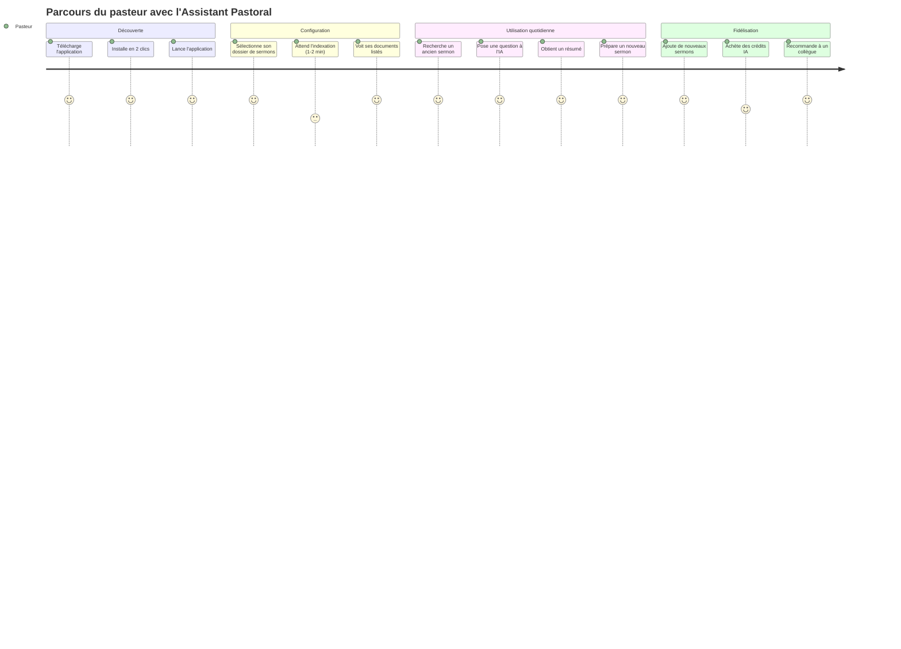

---

## 2. Flux principal : Installation → Première recherche

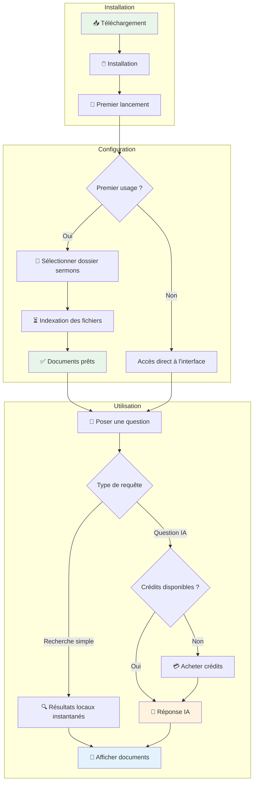

---

## 3. Architecture technique globale

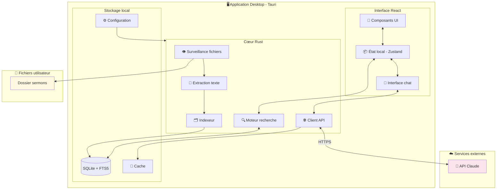

---

## 4. Flux d'indexation des documents

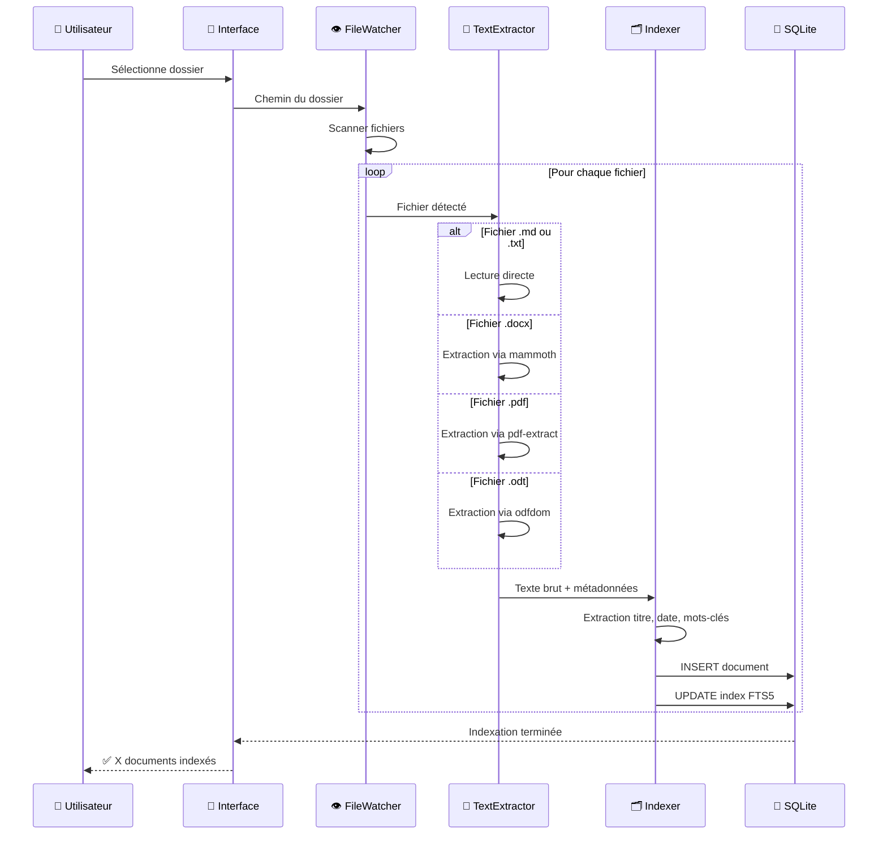

---

## 5. Flux de recherche locale (sans IA)

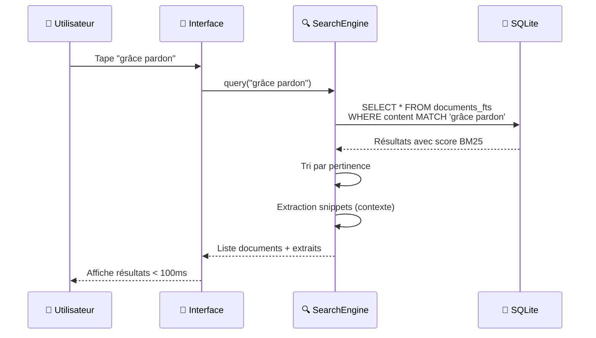

---

## 6. Flux de requête IA

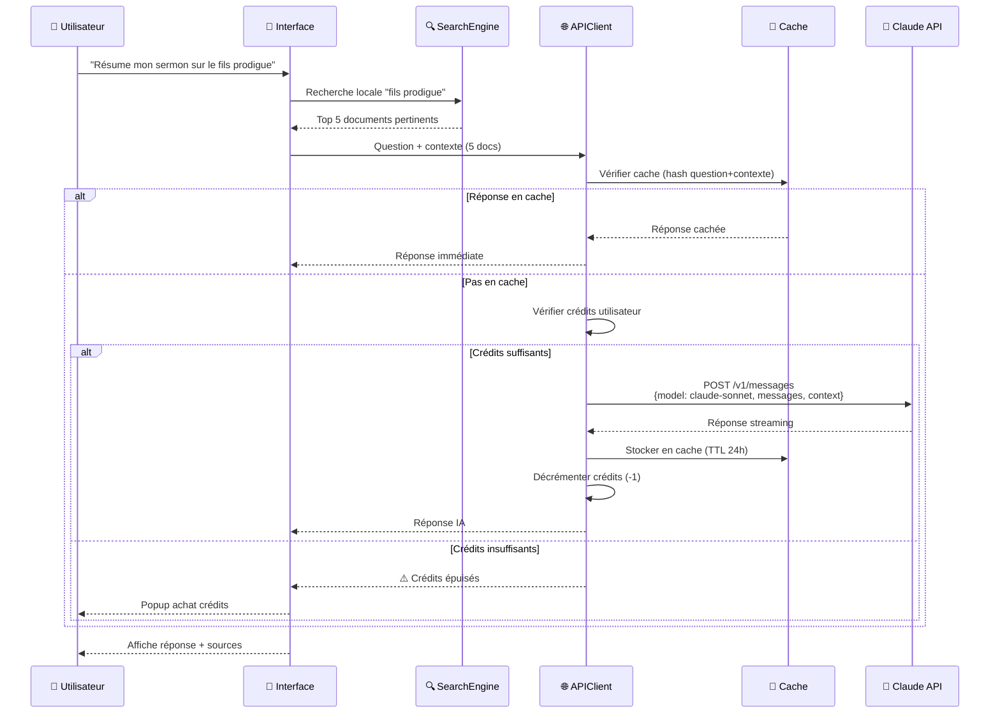

---

## 7. Structure de la base de données

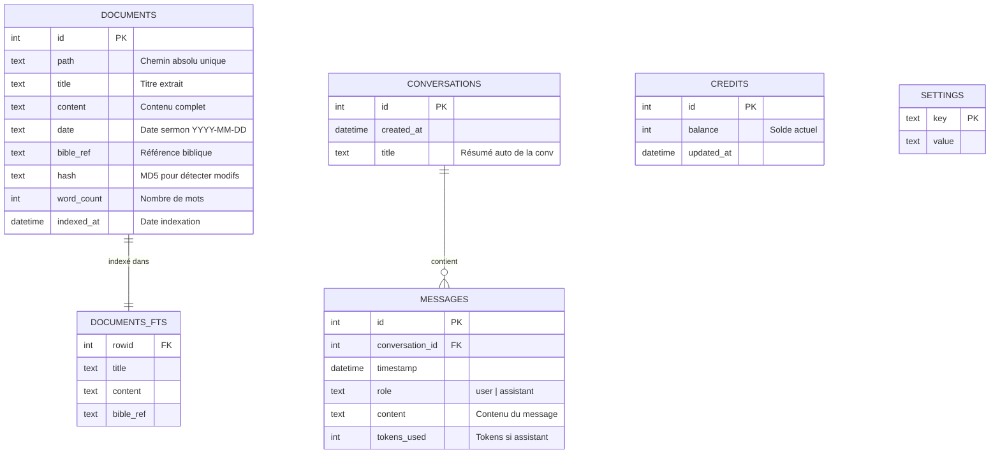

---

## 8. États de l'application

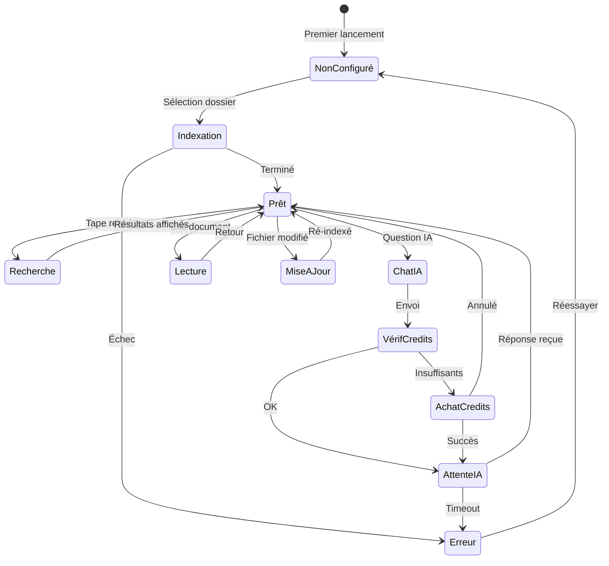

---

## 9. Workflow préparation sermon du dimanche

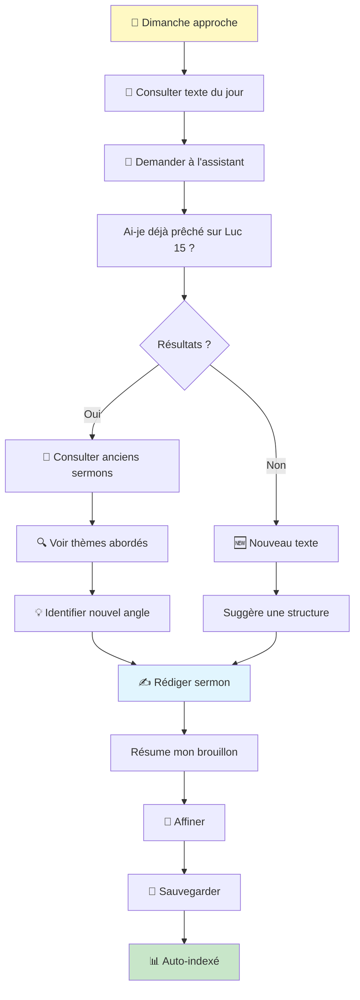

---

## 10. Composants de l'interface

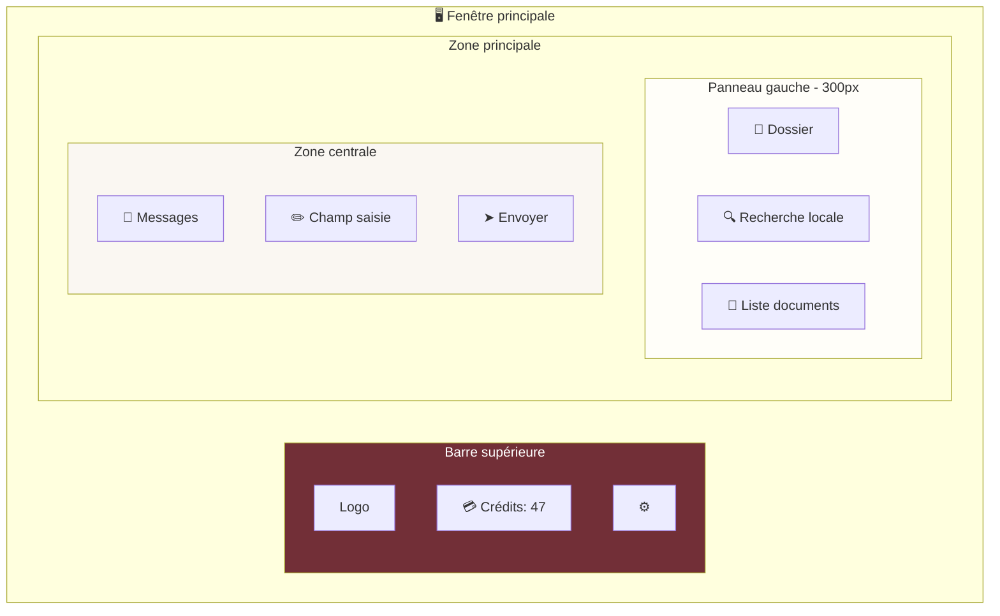

---

## 11. Planning Gantt (8 semaines)

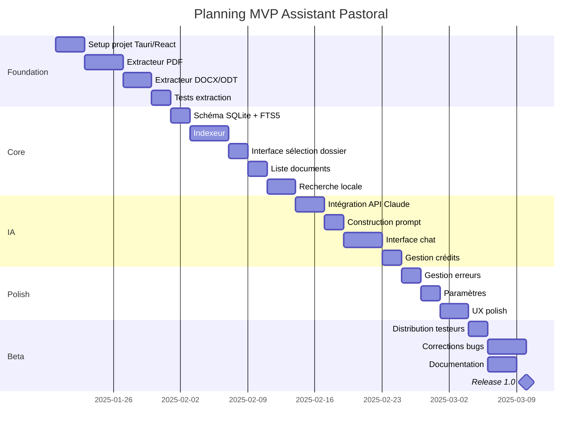

---

## 12. Flux d'achat de crédits

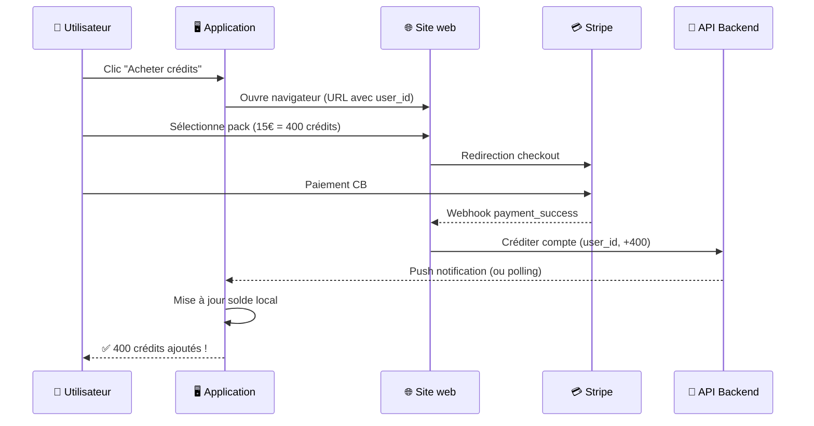

---

## 13. Arbre de décision : Recherche locale vs IA

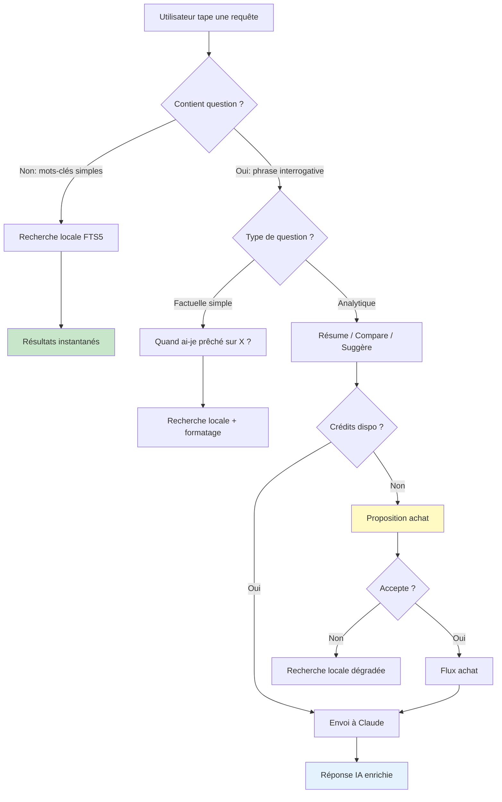

---

## 14. Sécurité : Flux des données

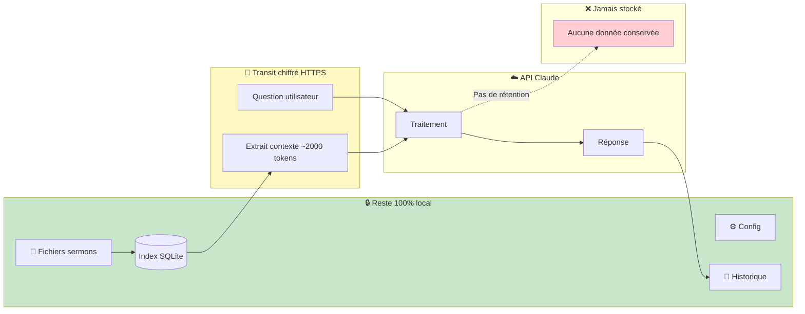

---

## 15. Métriques et tableau de bord

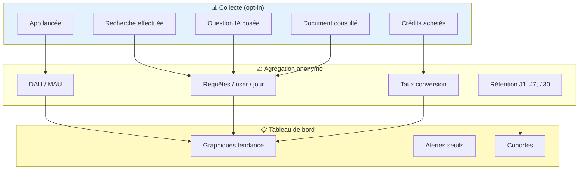

---

*Ce document Markdown accompagne le PRD Word et fournit les diagrammes techniques de référence pour l'équipe de développement.*
