# PRD Assistant Pastoral — Diagrammes techniques

Ce document complète le PRD Word avec les diagrammes Mermaid pour les workflows.

---

## 1. Parcours utilisateur global


---

## 2. Flux principal : Installation → Première recherche

```mermaid
flowchart TD
    subgraph Installation
        A[📥 Téléchargement] --> B[🖱️ Installation]
        B --> C[🚀 Premier lancement]
    end

    subgraph Configuration
        C --> D{Premier usage ?}
        D -->|Oui| E[📂 Sélectionner dossier sermons]
        D -->|Non| K[Accès direct à l'interface]
        E --> F[⏳ Indexation des fichiers]
        F --> G[✅ Documents prêts]
    end

    subgraph Utilisation
        G --> H[💬 Poser une question]
        K --> H
        H --> I{Type de requête}
        I -->|Recherche simple| J[🔍 Résultats locaux instantanés]
        I -->|Question IA| L{Crédits disponibles ?}
        L -->|Oui| M[🤖 Réponse IA]
        L -->|Non| N[💳 Acheter crédits]
        N --> M
        J --> O[📄 Afficher documents]
        M --> O
    end

    style A fill:#e8f5e9
    style G fill:#e8f5e9
    style M fill:#fff3e0
    style O fill:#e3f2fd
```

---

## 3. Architecture technique globale

```mermaid
flowchart TB
    subgraph Desktop["🖥️ Application Desktop - Tauri"]
        subgraph Frontend["Interface React"]
            UI[🎨 Composants UI]
            State[📦 État local - Zustand]
            Chat[💬 Interface chat]
        end
        
        subgraph Backend["Cœur Rust"]
            FileWatcher[👁️ Surveillance fichiers]
            TextExtractor[📄 Extraction texte]
            Indexer[🗂️ Indexeur]
            SearchEngine[🔍 Moteur recherche]
            APIClient[🌐 Client API]
        end
        
        subgraph Storage["Stockage local"]
            SQLite[(SQLite + FTS5)]
            Config[⚙️ Configuration]
            Cache[💾 Cache]
        end
    end
    
    subgraph External["☁️ Services externes"]
        Claude[🤖 API Claude]
    end
    
    subgraph UserFiles["📁 Fichiers utilisateur"]
        Sermons[Dossier sermons]
    end
    
    UI <--> State
    State <--> Chat
    Chat <--> APIClient
    
    FileWatcher --> Sermons
    FileWatcher --> TextExtractor
    TextExtractor --> Indexer
    Indexer --> SQLite
    
    SearchEngine <--> SQLite
    State <--> SearchEngine
    
    APIClient <-->|HTTPS| Claude
    APIClient --> Cache
    
    Config --> Backend

    style Claude fill:#fce4ec
    style SQLite fill:#e8eaf6
    style Sermons fill:#fff8e1
```

---

## 4. Flux d'indexation des documents

```mermaid
sequenceDiagram
    participant U as 👤 Utilisateur
    participant UI as 🎨 Interface
    participant FW as 👁️ FileWatcher
    participant TE as 📄 TextExtractor
    participant IX as 🗂️ Indexer
    participant DB as 💾 SQLite

    U->>UI: Sélectionne dossier
    UI->>FW: Chemin du dossier
    
    FW->>FW: Scanner fichiers
    
    loop Pour chaque fichier
        FW->>TE: Fichier détecté
        
        alt Fichier .md ou .txt
            TE->>TE: Lecture directe
        else Fichier .docx
            TE->>TE: Extraction via mammoth
        else Fichier .pdf
            TE->>TE: Extraction via pdf-extract
        else Fichier .odt
            TE->>TE: Extraction via odfdom
        end
        
        TE->>IX: Texte brut + métadonnées
        IX->>IX: Extraction titre, date, mots-clés
        IX->>DB: INSERT document
        IX->>DB: UPDATE index FTS5
    end
    
    DB-->>UI: Indexation terminée
    UI-->>U: ✅ X documents indexés
```

---

## 5. Flux de recherche locale (sans IA)

```mermaid
sequenceDiagram
    participant U as 👤 Utilisateur
    participant UI as 🎨 Interface
    participant SE as 🔍 SearchEngine
    participant DB as 💾 SQLite

    U->>UI: Tape "grâce pardon"
    UI->>SE: query("grâce pardon")
    
    SE->>DB: SELECT * FROM documents_fts<br/>WHERE content MATCH 'grâce pardon'
    DB-->>SE: Résultats avec score BM25
    
    SE->>SE: Tri par pertinence
    SE->>SE: Extraction snippets (contexte)
    
    SE-->>UI: Liste documents + extraits
    UI-->>U: Affiche résultats < 100ms
```

---

## 6. Flux de requête IA

```mermaid
sequenceDiagram
    participant U as 👤 Utilisateur
    participant UI as 🎨 Interface
    participant SE as 🔍 SearchEngine
    participant AC as 🌐 APIClient
    participant CA as 💾 Cache
    participant CL as 🤖 Claude API

    U->>UI: "Résume mon sermon sur le fils prodigue"
    
    UI->>SE: Recherche locale "fils prodigue"
    SE-->>UI: Top 5 documents pertinents
    
    UI->>AC: Question + contexte (5 docs)
    
    AC->>CA: Vérifier cache (hash question+contexte)
    
    alt Réponse en cache
        CA-->>AC: Réponse cachée
        AC-->>UI: Réponse immédiate
    else Pas en cache
        AC->>AC: Vérifier crédits utilisateur
        
        alt Crédits suffisants
            AC->>CL: POST /v1/messages<br/>{model: claude-sonnet, messages, context}
            CL-->>AC: Réponse streaming
            AC->>CA: Stocker en cache (TTL 24h)
            AC->>AC: Décrémenter crédits (-1)
            AC-->>UI: Réponse IA
        else Crédits insuffisants
            AC-->>UI: ⚠️ Crédits épuisés
            UI-->>U: Popup achat crédits
        end
    end
    
    UI-->>U: Affiche réponse + sources
```

---

## 7. Structure de la base de données


---

## 8. États de l'application

```mermaid
stateDiagram-v2
    [*] --> NonConfiguré: Premier lancement
    
    NonConfiguré --> Indexation: Sélection dossier
    Indexation --> Prêt: Terminé
    Indexation --> Erreur: Échec
    
    Erreur --> NonConfiguré: Réessayer
    
    Prêt --> Recherche: Tape requête
    Prêt --> ChatIA: Question IA
    Prêt --> Lecture: Clic document
    
    Recherche --> Prêt: Résultats affichés
    Lecture --> Prêt: Retour
    
    ChatIA --> VérifCredits: Envoi
    VérifCredits --> AttenteIA: OK
    VérifCredits --> AchatCredits: Insuffisants
    AchatCredits --> AttenteIA: Succès
    AchatCredits --> Prêt: Annulé
    
    AttenteIA --> Prêt: Réponse reçue
    AttenteIA --> Erreur: Timeout

    Prêt --> MiseAJour: Fichier modifié
    MiseAJour --> Prêt: Ré-indexé
```

---

## 9. Workflow préparation sermon du dimanche

```mermaid
flowchart TD
    A[📅 Dimanche approche] --> B[📖 Consulter texte du jour]
    B --> C[💬 Demander à l'assistant]
    C --> D["Ai-je déjà prêché sur Luc 15 ?"]
    D --> E{Résultats ?}
    
    E -->|Oui| F[📄 Consulter anciens sermons]
    F --> G[🔍 Voir thèmes abordés]
    G --> H[💡 Identifier nouvel angle]
    
    E -->|Non| I[🆕 Nouveau texte]
    I --> J["Suggère une structure"]
    
    H --> K[✍️ Rédiger sermon]
    J --> K
    
    K --> L["Résume mon brouillon"]
    L --> M[🔄 Affiner]
    M --> N[💾 Sauvegarder]
    N --> O[📊 Auto-indexé]

    style A fill:#fff9c4
    style K fill:#e1f5fe
    style O fill:#c8e6c9
```

---

## 10. Composants de l'interface

```mermaid
flowchart TB
    subgraph Window["🖥️ Fenêtre principale"]
        subgraph Header["Barre supérieure"]
            Logo[Logo]
            Credits[💳 Crédits: 47]
            Settings[⚙️]
        end
        
        subgraph Main["Zone principale"]
            subgraph Sidebar["Panneau gauche - 300px"]
                FolderBtn[📂 Dossier]
                SearchLocal[🔍 Recherche locale]
                DocList[📄 Liste documents]
            end
            
            subgraph ChatArea["Zone centrale"]
                Messages[💬 Messages]
                Input[✏️ Champ saisie]
                SendBtn[➤ Envoyer]
            end
        end
    end

    style Header fill:#722F37,color:#fff
    style Sidebar fill:#FFFEF9
    style ChatArea fill:#FAF7F2
```

---

## 11. Planning Gantt (8 semaines)


---

## 12. Flux d'achat de crédits

```mermaid
sequenceDiagram
    participant U as 👤 Utilisateur
    participant App as 🖥️ Application
    participant Web as 🌐 Site web
    participant Stripe as 💳 Stripe
    participant API as 🔧 API Backend

    U->>App: Clic "Acheter crédits"
    App->>Web: Ouvre navigateur (URL avec user_id)
    
    U->>Web: Sélectionne pack (15€ = 400 crédits)
    Web->>Stripe: Redirection checkout
    
    U->>Stripe: Paiement CB
    Stripe-->>Web: Webhook payment_success
    
    Web->>API: Créditer compte (user_id, +400)
    API-->>App: Push notification (ou polling)
    
    App->>App: Mise à jour solde local
    App-->>U: ✅ 400 crédits ajoutés !
```

---

## 13. Arbre de décision : Recherche locale vs IA

```mermaid
flowchart TD
    A[Utilisateur tape une requête] --> B{Contient question ?}
    
    B -->|Non: mots-clés simples| C[Recherche locale FTS5]
    C --> D[Résultats instantanés]
    
    B -->|Oui: phrase interrogative| E{Type de question ?}
    
    E -->|Factuelle simple| F["Quand ai-je prêché sur X ?"]
    F --> G[Recherche locale + formatage]
    
    E -->|Analytique| H["Résume / Compare / Suggère"]
    H --> I{Crédits dispo ?}
    
    I -->|Oui| J[Envoi à Claude]
    J --> K[Réponse IA enrichie]
    
    I -->|Non| L[Proposition achat]
    L --> M{Accepte ?}
    M -->|Oui| N[Flux achat]
    N --> J
    M -->|Non| O[Recherche locale dégradée]

    style D fill:#c8e6c9
    style K fill:#e3f2fd
    style L fill:#fff9c4
```

---

## 14. Sécurité : Flux des données

```mermaid
flowchart LR
    subgraph Local["🔒 Reste 100% local"]
        Sermons[📄 Fichiers sermons]
        Index[(Index SQLite)]
        Config[⚙️ Config]
        History[💬 Historique]
    end
    
    subgraph Transit["🔐 Transit chiffré HTTPS"]
        Question[Question utilisateur]
        Context[Extrait contexte ~2000 tokens]
    end
    
    subgraph Claude["☁️ API Claude"]
        Process[Traitement]
        Response[Réponse]
    end
    
    subgraph Stockage["❌ Jamais stocké"]
        Nothing[Aucune donnée conservée]
    end
    
    Sermons --> Index
    Index --> Context
    Question --> Process
    Context --> Process
    Process --> Response
    Response --> History
    
    Process -.->|Pas de rétention| Nothing

    style Local fill:#c8e6c9
    style Transit fill:#fff9c4
    style Nothing fill:#ffcdd2
```

---

## 15. Métriques et tableau de bord

```mermaid
flowchart TB
    subgraph Collecte["📊 Collecte (opt-in)"]
        E1[App lancée]
        E2[Recherche effectuée]
        E3[Question IA posée]
        E4[Document consulté]
        E5[Crédits achetés]
    end
    
    subgraph Agrégation["📈 Agrégation anonyme"]
        M1[DAU / MAU]
        M2[Requêtes / user / jour]
        M3[Taux conversion]
        M4[Rétention J1, J7, J30]
    end
    
    subgraph Dashboard["📋 Tableau de bord"]
        D1[Graphiques tendance]
        D2[Alertes seuils]
        D3[Cohortes]
    end
    
    E1 --> M1
    E2 --> M2
    E3 --> M2
    E4 --> M2
    E5 --> M3
    
    M1 --> D1
    M2 --> D1
    M3 --> D1
    M4 --> D3

    style Collecte fill:#e3f2fd
    style Dashboard fill:#fff9c4
```

---

*Ce document Markdown accompagne le PRD Word et fournit les diagrammes techniques de référence pour l'équipe de développement.*
